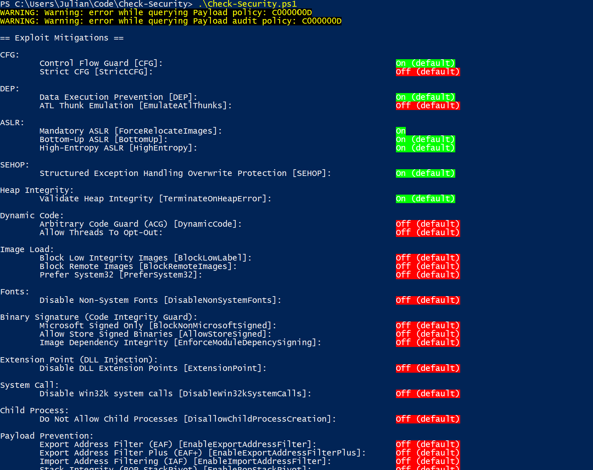

# Check-Security

Written in the style of [checksec.sh](https://www.trapkit.de/tools/checksec.html) for Linux.
Check-Security is a simpler view of the current state of the exploit mitigation settings on your machine.

Microsoft [deprecated EMET](https://support.microsoft.com/en-us/help/2458544/the-enhanced-mitigation-experience-toolkit)and added
[that exploit mitigation functionality](https://docs.microsoft.com/en-us/windows/security/threat-protection/windows-defender-exploit-guard/exploit-protection-exploit-guard),
now called [Windows Defender Exploit Guard](https://www.microsoft.com/security/blog/2017/10/23/windows-defender-exploit-guard-reduce-the-attack-surface-against-next-generation-malware/),
into Windows 10.

<blockquote class="twitter-tweet" data-lang="en"><p lang="en" dir="ltr">In response to this, I plan on writing a tool that helps defensive teams enumerate the exploit mitigations available and enabled on their Windows devices so they can better understand their exploitation landscape and how useless the technologies are that bad vendors are selling.</p>&mdash; Julian Cohen (@HockeyInJune) <a href="https://twitter.com/HockeyInJune/status/1071506842600263680?ref_src=twsrc%5Etfw">December 8, 2018</a></blockquote>
<script async src="https://platform.twitter.com/widgets.js" charset="utf-8"></script>

## Use

Run `Check-Security` with the same parameters you would use with `Get-ProcessMitigation`.

Run without parameters to system defaults.

```
.\Check-Security.ps1
```

Run with parameters like this to get settings for specific processes.

```
.\Check-Security.ps1 -Name iexplore.exe
```

## Output

For each exploit mitigation `Check-Security` will output "On", "Off", "On (default)", "Off (default)", or "Unexpected value!".

```
Category:
    Specific Mitigation (More details or Abbreviation) [CmdletName]:  Result
```

You can use the `CmdletName` to change the exploit mitigation settings with `Set-ProcessMitigation`.

```
Set-ProcessMitigation -System -Enable CmdletName
```

## Screenshot



## References

* [Customize exploit protection](https://docs.microsoft.com/en-us/windows/security/threat-protection/windows-defender-exploit-guard/customize-exploit-protection)
* [Protect devices from exploits](https://docs.microsoft.com/en-us/windows/security/threat-protection/windows-defender-exploit-guard/exploit-protection-exploit-guard)
* [Enable exploit protection](https://docs.microsoft.com/en-us/windows/security/threat-protection/windows-defender-exploit-guard/enable-exploit-protection)